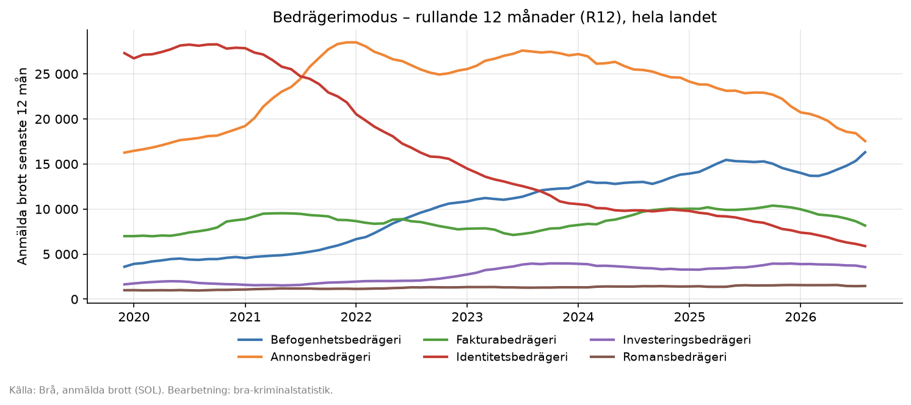
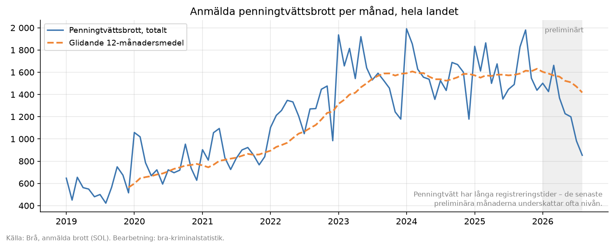
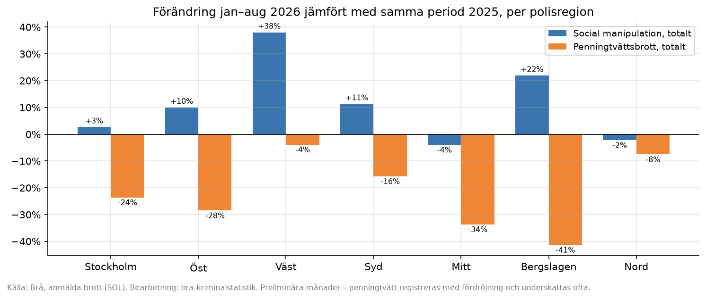
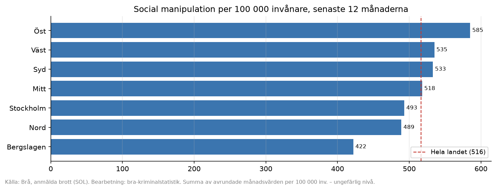
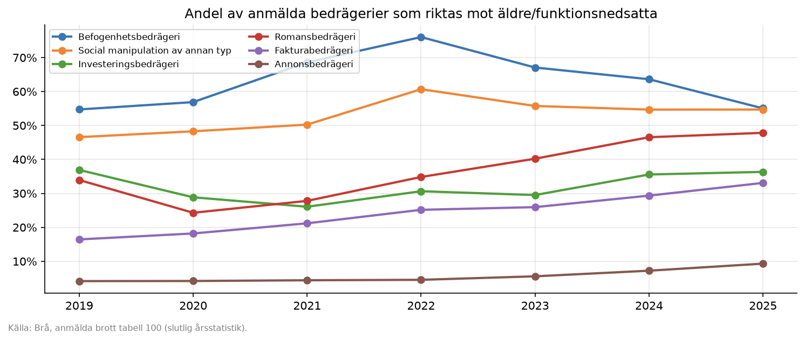
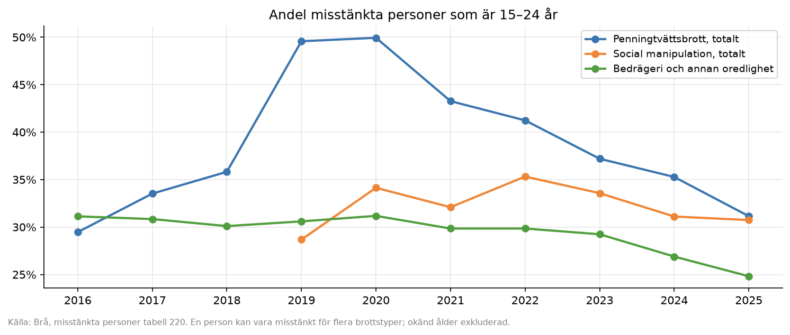
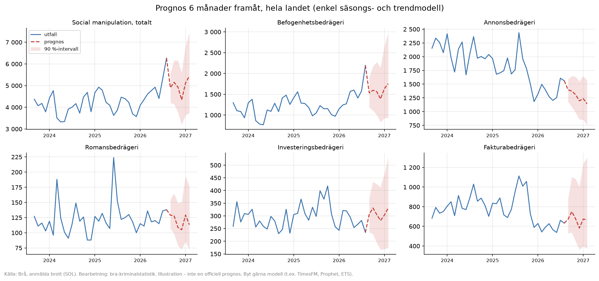

<div align="center">

# 📊 bra-kriminalstatistik

**Hämta Sveriges officiella kriminalstatistik från Brå och Domstolsverket automatiskt och analysera bedrägeri, penningtvätt och terrorfinansiering.**

[](https://github.com/overjoyde/bra-kriminalstatistik/actions/workflows/ci.yml)


-7f7f7f)



[Snabbstart](#-snabbstart) · [Vad kan man göra?](#-vad-kan-man-göra-med-datan) · [Dataseten](#-dataseten) · [Skript](#-skript) · [Kodkatalog AML/CTF](docs/02-brottskoder-aml-ctf-bedrageri.md) · [Domstolsverket](docs/04-domstolsverket-domstat.md) · [Teknik](docs/03-teknik-hamtning.md)

</div>

---

Brå publicerar statistik över anmälda, misstänkta och lagförda brott, men **har inget API**. Det här repot löser det:

| | |
|---|---|
| 🔎 **SOL-klient** | Egna uttag ur Brås statistikdatabas [SOL](https://statistik.bra.se/solwebb/action/index): 1 361 brottskoder och cirka 1 360 brottstyper, per **år, kvartal eller månad**, för **land, polisregion, län eller kommun**, från 1975 och framåt |
| 📥 **Tabellhämtare** | Cirka 250 färdiga Excel-tabeller från bra.se: anmälda, misstänkta (ålder och kön), lagförda och handlagda brott, målsägare, NTU, diagramdata och rapporter |
| ⚖️ **Domstolsverket** | Årsdata ur [DOMstat](https://pxweb.etjanst.domstol.se/PxWeb/pxweb/sv/DOMstat/) via dess öppna API: brottmål i tingsrätt/hovrätt/HD, handläggningstider, häktning, ungdomsmål, överklaganden samt **konkurser, företagsrekonstruktioner och skuldsaneringar** per domstol, från 2002 |
| 🎯 **Bevakningslista** | Ett kommando hämtar 19 färdiga serier om bedrägeri, penningtvätt, terrorfinansiering och sanktioner, på cirka 30 sekunder |
| 📈 **Analys** | Exempelgrafer, Excel-dashboard och fristående HTML-dashboard. All data sparas som CSV i långt format och passar pandas, Excel, Power BI och R |
| 📚 **Kodkatalog** | Vilka brottskoder som rör [penningtvätt, CTF, sanktioner och bedrägeri](docs/02-brottskoder-aml-ctf-bedrageri.md), och hur de ändrats över tid |
| 💻 **Alla plattformar** | Körskript för macOS/Linux (`.sh`) och Windows (`.ps1`/`.bat`), med schemaläggning via launchd, cron och Windows Schemaläggaren |

## 🚀 Snabbstart

<table>
<tr><th>macOS / Linux</th><th>Windows</th></tr>
<tr><td>

```bash
git clone https://github.com/overjoyde/bra-kriminalstatistik.git
cd bra-kriminalstatistik
./run/mac-linux/setup.sh
./run/mac-linux/fetch_all.sh --no-pdf
open data/dashboard/Bra_trendbevakning_dashboard.html
```

</td><td>

```powershell
git clone https://github.com/overjoyde/bra-kriminalstatistik.git
cd bra-kriminalstatistik
run\windows\setup.bat
run\windows\fetch_all.bat --no-pdf
start data\dashboard\Bra_trendbevakning_dashboard.html
```

</td></tr>
</table>

`fetch_all` hämtar tabeller och SOL-serier och bygger sedan dashboards och grafer. Första körningen tar cirka 5 minuter. Behöver du bara siffrorna räcker `sol_watchlist` (cirka 30 sekunder), och resultatet hamnar i `data/sol/watchlist_samlad.csv`.

> Kräver Python 3.10 eller senare. På Windows: `winget install Python.Python.3.12`. Själva hämtningen använder bara standardbiblioteket. pandas, openpyxl och matplotlib behövs bara för analys och grafer.

---

## 💡 Vad kan man göra med datan?

Alla grafer nedan skapas från den hämtade datan med `python scripts/make_charts.py` (eller `run/…/make_charts`). Koden i [`scripts/make_charts.py`](scripts/make_charts.py) kan användas som mall för egna analyser. Siffrorna gäller hämtningen 2026-09-24.

### 1. Följa trender månad för månad



Månadsserier finns från 1995, och i SOL även per brottskod. Ett **glidande 12-månadersmedel** jämnar ut säsong och enstaka toppar. Anmälda penningtvättsbrott nästan **tredubblades mellan 2019 och 2025**.

> ⚠️ Månadsstatistiken är **preliminär** tills den fryses i februari. Penningtvätt registreras med lång fördröjning, så de senaste månaderna ser ofta lägre ut än de blir. Använd hellre R12 eller slutlig årsstatistik för slutsatser.

### 2. Jämföra bedrägerityper (modus)


Sedan 2019 delar Brå in bedrägerier efter **modus**, t.ex. befogenhets-, romans-, investerings-, faktura-, identitets- och annonsbedrägeri. Med rullande 12 månader syns hur brottsligheten flyttar: **identitetsbedrägeri har minskat kraftigt, och befogenhetsbedrägeri (falska bank- eller polissamtal) har ökat stadigt.**

### 3. Årstabell – nivåer och förändring

Skapas som Markdown av `make_charts.py` (`data/charts/arstabell.md`). Källa: Brå tabell 100, slutlig statistik, antal anmälda brott i hela landet.

| Brottstyp | 2019 | 2020 | 2021 | 2022 | 2023 | 2024 | 2025 | Förändring |
|---|---:|---:|---:|---:|---:|---:|---:|---:|
| Bedrägeri och annan oredlighet | 244 696 | 218 308 | 195 902 | 195 929 | 238 371 | 230 330 | 232 862 | −5 % |
| **Social manipulation, totalt** | 14 760 | 18 219 | 24 446 | 35 057 | 47 526 | 48 147 | 50 571 | **+243 %** |
| ↳ Befogenhetsbedrägeri | 3 600 | 4 676 | 6 282 | 10 722 | 12 312 | 13 816 | 14 278 | +297 % |
| ↳ Romansbedrägeri | 993 | 1 058 | 1 162 | 1 312 | 1 318 | 1 403 | 1 572 | +58 % |
| ↳ Investeringsbedrägeri | 1 642 | 1 643 | 1 899 | 2 566 | 3 961 | 3 287 | 3 952 | +141 % |
| Fakturabedrägeri | 6 994 | 8 760 | 8 776 | 7 749 | 8 110 | 10 007 | 10 180 | +46 % |
| Identitetsbedrägeri | 27 299 | 27 901 | 21 836 | 15 041 | 10 636 | 9 872 | 7 641 | −72 % |
| Annonsbedrägeri | 16 264 | 18 844 | 28 495 | 25 356 | 27 046 | 24 584 | 21 377 | +31 % |
| Kortbedrägeri utan fysiskt kort | 106 784 | 80 532 | 52 619 | 58 013 | 88 973 | 85 448 | 94 315 | −12 % |
| Olovlig identitetsanvändning | 29 255 | 31 427 | 26 499 | 19 329 | 16 833 | 17 759 | 15 437 | −47 % |
| **Penningtvättsbrott, totalt** | 6 767 | 9 303 | 10 532 | 14 954 | 19 033 | 19 017 | 19 571 | **+189 %** |

<details>
<summary><b>Näringspenningtvätt, terrorfinansiering och sanktionsbrott</b> (små tal, per brottskod från SOL)</summary>

| Kod | Brott | 2019 | 2020 | 2021 | 2022 | 2023 | 2024 | 2025 |
|---|---|---:|---:|---:|---:|---:|---:|---:|
| 5124 | Näringspenningtvätt | 121 | 175 | 276 | 319 | 434 | 437 | 495 |
| 5125 | Grov näringspenningtvätt | 241 | 294 | 280 | 267 | 290 | 503 | 520 |
| 5126 | Ringa näringspenningtvätt | 15 | 84 | 193 | 210 | 221 | 354 | 252 |
| 7035 | Finansiering av terroristbrott | – | – | – | – | 3 | 1 | 3 |
| 7036 | Finansiering av annan särskilt allvarlig brottslighet | – | – | – | – | 0 | 0 | 1 |
| 7037 | Finansiering av terroristorganisation m.m. | – | – | – | – | 7 | 4 | 3 |
| 7014–7016 | Brott mot sanktionsföreskrifter (upphörde 2025) | 3 | 1 | 0 | 15 | 1 | 12 | 17 |

– = koden fanns inte (terroristbrottslagen gäller från 2023). Så små tal räcker inte för trendanalys men ger kontext.
</details>

### 4. Geografi – var ökar det?

<table><tr>
<td width="50%"></td>
<td width="50%"></td>
</tr></table>

SOL har data per **polisregion** (från 2015), **län** (1975–2014), **kommun** (från 1996) och **stadsområde** i Stockholm, Göteborg och Malmö. Två vanliga vyer:

- **Hittills i år** jämfört med samma period i fjol, per region.
- **Per 100 000 invånare**, som gör regioner av olika storlek jämförbara.

Observera att bedrägerier ofta saknar brottsplats. Kommunstatistiken har därför stort bortfall för bedrägeri, medan regionstatistiken utgår från var brottet handlagts.

### 5. Vem drabbas? Brott mot äldre



Flera bedrägeritypers koder anger om brottet riktades **mot äldre eller funktionsnedsatta**. Mer än hälften av de anmälda befogenhetsbedrägerierna gäller äldre (55–76 % beroende på år), och andelen **romans- och fakturabedrägerier mot äldre har ökat** varje år sedan 2021. Detta är användbart för riktade kundskydd och förebyggande information.

### 6. Vilka är misstänkta? Unga som målvakter



Tabell 220 (misstänkta personer efter brottstyp, ålder och kön) visar åldersprofilen. Runt 2019–2020 var **hälften av de misstänkta för penningtvätt 15–24 år**, vilket stämmer med bilden av unga som rekryteras som målvakter (*money mules*). Andelen har sedan sjunkit till cirka 31 %, men antalet misstänkta har ökat.

### 7. Prognoser och avvikelser



Månadsserierna räcker för enkla prognoser och **avvikelselarm**, t.ex. att flagga när en månad hamnar utanför 90 %-intervallet. Exemplet använder en beroendefri säsongs- och trendmodell (`seasonal_forecast()` i `make_charts.py`). Byt gärna till ETS, Prophet, TimesFM eller BigQuery `AI.FORECAST`.

### Fler idéer

| Fråga | Dataset | Kommando |
|---|---|---|
| Hur stor andel av bedrägerierna klaras upp? | Handlagda brott, tabell 300–320 | `fetch_tables.py --groups handlagda` |
| Hur slutar penningtvättsärenden (åtal, strafföreläggande)? | Lagförda, tabell 420/450 | `fetch_tables.py --groups lagforda` |
| Hur många utsätts men anmäler inte? | NTU (kort-, kredit- och försäljningsbedrägeri) | `fetch_tables.py --groups enkater` |
| Vilka kommuner har flest anmälda brott av en viss typ? | SOL, kommunmenyer | `sol_query.py --menu brottstyp-ar-kommun …` |
| Har kortbedrägeri flyttat till social manipulation? | Kod 0982/0983 jämfört med 0942–0957 | `sol_query.py --menu brottskod-manad-region …` |
| Ökar handel med kort- och inloggningsuppgifter? | Kod 0996, olovlig befattning med betalningsverktyg | `sol_query.py --codes 0996 …` |
| Används företag som brottsverktyg? | Näringspenningtvätt 5124–5126, bulvan/målvakt (ABL), näringsförbud | ingår i bevakningslistan |
| Jämföra med egen data | Alla CSV:er i långt format | pandas, Excel, Power BI |

---

## 🗂 Dataseten

| Dataset | Källa | Nivå | Period | Hämtas med |
|---|---|---|---|---|
| **Anmälda brott – egna uttag** | SOL | brottstyp/brottskod × land/region/län/kommun × år/kvartal/månad | 1975– (månad 1995–) | `sol_query.py`, `sol_watchlist.py` |
| Anmälda brott – månadsserier | bra.se P4 | alla brottstyper inkl. bedrägerimodus × land/region | 2015– | `fetch_tables.py --groups anmalda` |
| Anmälda brott – slutlig årsstatistik | bra.se tabell 100/110/120 | land, region, kommun, per 100 000 invånare | 10 år | ↑ |
| Misstänkta personer | bra.se tabell 220/230 | brottstyp × ålder × kön, lagföringsbeslut | 10 år | `--groups misstankta` |
| Lagförda personer | bra.se tabell 420/450/460 | huvudbrott × ålder/region | 10 år + serier från 1975 | `--groups lagforda` |
| Handlagda brott och uppklaring | bra.se tabell 300–320 | handläggningsbeslut | 10 år + halvår | `--groups handlagda` |
| Målsägare | bra.se | offrens ålder och kön | 2014– | `--groups malsagare` |
| NTU och Skolundersökningen | bra.se | utsatthet, även oanmält | 2007– | `--groups enkater` |
| Diagramdata från ämnessidor | bra.se | bedrägeri, penningtvätt och terrorfinansiering | varierar | `--groups amnessidor` |
| **Domstolsledet och insolvens** | Domstolsverket DOMstat (API) | 69 tabeller: domstol × målkategori × år – brottmål, tider, häktning, unga, konkurser, skuldsanering. Ingen brottskodsuppdelning. | 2002– (år) | `domstat_watchlist.py`, `domstat_query.py` |
| Rapporter och metod (PDF) | bra.se | t.ex. *Företag som brottsverktyg*, *Penningtvättsbrott*, kvalitetsdeklarationer | – | `--groups rapporter metod` |

Detaljer om täckning, sekretess och tolkning finns i [docs/01-datakallor.md](docs/01-datakallor.md) och, för Domstolsverket, i [docs/04-domstolsverket-domstat.md](docs/04-domstolsverket-domstat.md).

**Format på SOL-uttagen** (CSV, semikolon, UTF-8 med BOM så att filen öppnas rätt i Excel):

```text
serie;kategori;meny;brott_id;brottskod;brott;sokvag;omrade;period;ar;manad;kvartal;periodtyp;preliminar;antal;per_100k
befogenhetsbedrageri;Social manipulation (APP-bedrägeri);brottstyp-manad-region;14024;;Befogenhetsbedrägeri;…;Hela landet;2023-01;2023;1;;manad;False;946.0;9.0
```

---

## 🧰 Skript

| Uppgift | Python | macOS/Linux | Windows |
|---|---|---|---|
| Installera | – | `run/mac-linux/setup.sh` | `run\windows\setup.bat` |
| **Hela kedjan** | `scripts/fetch_all.py` | `fetch_all.sh` | `fetch_all.bat` |
| Färdiga tabeller från bra.se | `scripts/fetch_tables.py` | `fetch_tables.sh` | `fetch_tables.bat` |
| SOL: bevakningslista | `scripts/sol_watchlist.py` | `sol_watchlist.sh` | `sol_watchlist.bat` |
| SOL: eget uttag | `scripts/sol_query.py` | `sol_query.sh` | `sol_query.bat` |
| SOL: sök eller exportera koder | `scripts/sol_catalog.py` | `sol_catalog.sh` | `sol_catalog.bat` |
| DOMstat: bevakningslista | `scripts/domstat_watchlist.py` | `domstat_watchlist.sh` | `domstat_watchlist.bat` |
| DOMstat: eget uttag | `scripts/domstat_query.py` | `domstat_query.sh` | `domstat_query.bat` |
| DOMstat: sök tabeller | `scripts/domstat_catalog.py` | `domstat_catalog.sh` | `domstat_catalog.bat` |
| Exempelgrafer och årstabell | `scripts/make_charts.py` | `make_charts.sh` | `make_charts.bat` |
| Excel- och HTML-dashboard | `scripts/build_excel_dashboard.py`, `build_html_dashboard.py` | `build_dashboards.sh` | `build_dashboards.bat` |
| Schemalägg månadsvis | – | `schedule_macos.sh` / `schedule_cron.sh` | `schedule_task.bat` |
| Felsök bra.se-formulär | `scripts/inspect_forms.py` | – | – |

Varje `.bat` har en `.ps1` bredvid sig, och alla skript har `--help`. Argument skickas vidare till Python.

### Egna uttag ur SOL

```bash
# 1. Hitta rätt kod eller id
python scripts/sol_catalog.py --menus brottskod-ar-region --search penningtvätt

# 2. Befogenhetsbedrägeri mot äldre (0950 + 0951) per månad, hela landet och alla polisregioner
python scripts/sol_query.py --menu brottskod-manad-region --codes 0950 0951 \
    --periods 2024-01..2026-08 --all-regions

# 3. Penningtvätt (brottstyp 13092) per år, med antal per 100 000 invånare
python scripts/sol_query.py --menu brottstyp-ar-region --ids 13092 --periods 2015-2025

# 4. Direkt till skärmen, t.ex. för att skicka vidare till ett annat verktyg
python scripts/sol_query.py --menu brottskod-ar-region --codes 7035 7036 7037 --periods senaste --out -
```

| Parameter | Exempel |
|---|---|
| `--menu` | `brottstyp-ar-region`, `brottstyp-manad-region`, `brottstyp-ar-kommun`, `brottskod-ar-region`, `brottskod-manad-region` … (`sol_catalog.py --list-menus`) |
| `--periods` | `senaste`, `alla`, `2015-2025`, `2024,2025`, `2024-01..2026-08` |
| `--regions` | `"Hela landet"`, `Stockholm` (tolkas som Region Stockholm), `"Skåne län"`, kommunnamn. Eller `--all-regions`. |

### I Python eller en notebook

```python
from brastat.sol import SolClient
import pandas as pd

sol = SolClient()
df = pd.DataFrame(sol.query("brottstyp-manad-region", crime_ids=["14024"],   # befogenhetsbedrägeri
                            regions=["Hela landet", "Region Stockholm"], periods="2019-01..2026-12"))
df.pivot_table(index="period", columns="omrade", values="antal").plot()
```

### Egna uttag ur Domstolsverkets DOMstat

```bash
python scripts/domstat_catalog.py --search konkurs                      # hitta tabell
python scripts/domstat_catalog.py --table AntalMal/09_Konkurser_TR      # visa variabler och värden
python scripts/domstat_query.py --table AntalMal/02b_Malutveckling_per_malkategori_arenden_TR \
    --select "Domstol=Alla tingsrätter" "Målkategori=Skuldsanering,Konkursärenden" --years 2015-
```

Värden väljs med de svenska texterna. Se [docs/04-domstolsverket-domstat.md](docs/04-domstolsverket-domstat.md) för tabellöversikt, begränsningar och format.

### Egen bevakningslista

Kopiera [`config/watchlist_aml_fraud.json`](config/watchlist_aml_fraud.json), lägg till eller ta bort serier och kör `python scripts/sol_watchlist.py --config config/min_lista.json`. En serie anges så här:

```json
{"namn": "befogenhetsbedrageri_mot_aldre", "kategori": "Social manipulation",
 "meny": "brottskod-manad-region", "koder": ["0950", "0951"], "regioner": ["Hela landet"]}
```

### Schemaläggning

Brå släpper preliminär månadsstatistik cirka 10 dagar efter varje månadsskifte. Standardschemat kör därför **den 15:e varje månad kl. 07:00**.

| OS | Installera | Ta bort |
|---|---|---|
| macOS | `./run/mac-linux/schedule_macos.sh` ¹ | `--remove` |
| Linux | `./run/mac-linux/schedule_cron.sh` | `--remove` |
| Windows | `run\windows\schedule_task.bat` (eller `schedule_task.ps1 -Day 15 -Time 07:00`) | `-Remove` |

¹ launchd får inte läsa `~/Desktop`, `~/Documents` eller `~/Downloads`. Lägg repot t.ex. i `~/code/`.

---

## 📁 Struktur

```text
bra-kriminalstatistik/
├── brastat/            bibliotek: http.py (klient) · sol.py (SOL) · tabeller.py (bra.se) · domstat.py (Domstolsverket)
├── scripts/            kommandoradsskript (se tabellen ovan)
├── run/mac-linux/      .sh-skript + schemaläggning
├── run/windows/        .ps1 + .bat + schemaläggning
├── config/             bevakningslistor (JSON)
├── docs/               datakällor · kodkatalog AML/CTF · teknik · Domstolsverket · img/
├── reference/          brottskoder_sol.csv · brottstyper_sol.csv
├── tests/              offline-tester (körs i CI på Linux, macOS och Windows)
└── data/               ← skapas vid körning: sol/ domstat/ raw/ docs/ dashboard/ charts/ manifest.csv (checkas inte in)
```

## 🛟 Felsökning

| Problem | Lösning |
|---|---|
| `CERTIFICATE_VERIFY_FAILED` | `pip install truststore` (ingår i requirements). Klienten faller annars tillbaka på systemets `curl`. Det kan tvingas med `BRASTAT_HTTP=curl`. |
| `SOL-fel: …` | Servern kan vara nere, eller så har sessionsflödet ändrats. Se [docs/03](docs/03-teknik-hamtning.md). |
| `saknas` i `manifest.csv` | Tabellen är inte publicerad ännu (årstabeller kommer i mars–april) eller URL-mönstret har ändrats. Kör `scripts/inspect_forms.py`. |
| Skript blockeras i Windows | Använd `.bat`-filerna, som kör PowerShell med `-ExecutionPolicy Bypass`. |
| Konstiga tecken i Excel | Filerna är UTF-8 med BOM och semikolonseparerade. Använd Data → Från text/CSV. |

## ⚠️ Tolka med försiktighet

- **Anmälda brott är inte faktisk brottslighet.** Anmälningsbenägenhet, polisens prioriteringar och seriebrott (ett ärende kan ge hundratals anmälningar) påverkar nivåerna.
- **Brottskoder anger inte betalmedel.** Kopplingar till typologier är analytiska antaganden.
- **Preliminär månadsdata** revideras. Den slutliga årsstatistiken är facit.
- **Koder ändras och serier bryts**, t.ex. bedrägeriindelningen 2019, penninghäleri som ersattes 2014, terroristbrottslagen 2023 och sanktionslagen 2025. Se [kodkatalogen](docs/02-brottskoder-aml-ctf-bedrageri.md).

## 📜 Licens och källa

Koden är licensierad under MIT, se [LICENSE](LICENSE). **Datan kommer från Brottsförebyggande rådet (Brå)** och får vidareutnyttjas fritt. Ange *Källa: Brå* när du publicerar. Data från DOMstat är Sveriges officiella statistik från **Domstolsverket**; ange *Källa: Domstolsverket*. Repot är inte framtaget av eller associerat med Brå eller Domstolsverket.

Var snäll mot Brås och Domstolsverkets servrar: skripten väntar mellan anropen (DOMstat tillåter högst 10 anrop per 10 sekunder), och en schemalagd körning per månad räcker.

**Bidrag** är välkomna, t.ex. nya serier i bevakningslistan, nya bra.se-tabeller i `brastat/tabeller.py` eller fler analysexempel i `scripts/make_charts.py`. Kör `python -m unittest discover -s tests` innan du skickar en PR.
